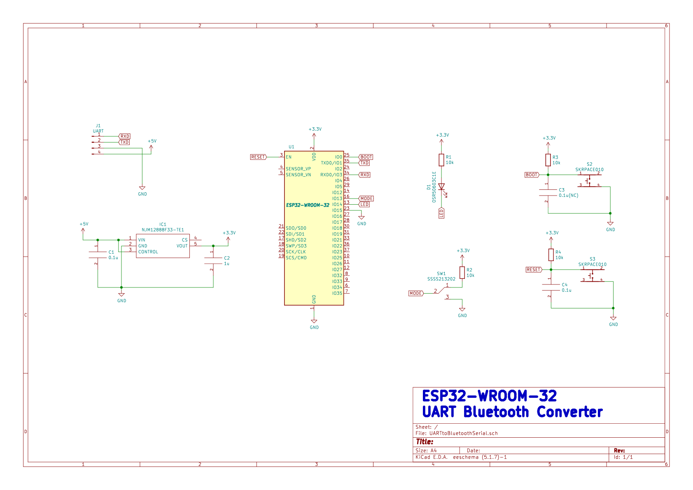

# ESP32_UART_Bluetooth_Converter
## 概要
ESP32-WROOM-32モジュールを使用した、UARTとBluetoothSPPを相互変換し、**シリアル通信を無線で行えるようにする**デバイスです。

無線通信機能がないマイコンでも、**プログラムの修正や新規の開発環境を導入する必要が無く、従来のシリアル通信と同じ感覚で通信が出来ます。**

**!!ESP32は3.3V駆動なので、5V駆動マイコンと接続する場合は分圧が必要です。!!**
~~5V繋いでもすぐには死ななかった~~
## 使用方法
本体のスライドスイッチでシリアル通信のボーレートを選択する。(9600bps/115200bps)

マイコン等に本体を接続する。

本体に電源を繋いだらBluetooth接続待ち状態に入る。

通信するPCのBluetoothデバイスの追加にてESP32-XXXXを追加。
デバイス設定にて任意のボーレートを選択。
この際に仮想COMポートのポート番号も確認するとよい。

teraterm等のターミナルソフトで仮想COMポートを開いて通信開始。

**スマートフォンでも任意のターミナルソフトで通信可能です。**
## 回路図

### ファームウェア書き込み方法
秋月電子の[超小型ＵＳＢシリアル変換モジュール](https://akizukidenshi.com/catalog/g/gM-08461/)のようなモジュールを用いて、PCと本体を接続する。

BOOTボタンを押しながらRESETボタンを押し、ファームウェア書き込みモードに移行する。

ArduinoIDEでファームウェアを開いて書き込み開始。

**ESP32に書き込むためには別途設定が必要です[(参考サイト)](https://spiceman.jp/esp32-arduino-ide/#Arduino_IDE)**

書き込み終了後RESETボタンを押すことで起動する。

### 起動時のUARTログ設定
ESP32へのファームウェア書き込みと、UART送受信はUART1を共有する。
通常ESP32は起動時にログをUART1から出力する。
これがあると、マイコンとの通信にゴミが入ることになる。
dataseetに、GPIO5にてこのログの出力設定ができるとある。

この表からGPIO5をGNDに落とせばログが出力されなくなることが分かるので、GPIO5はGNDに接続する。

